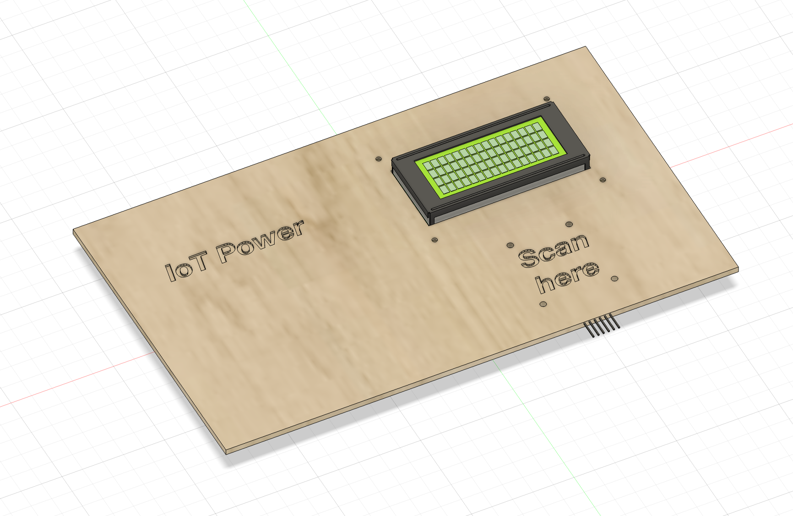
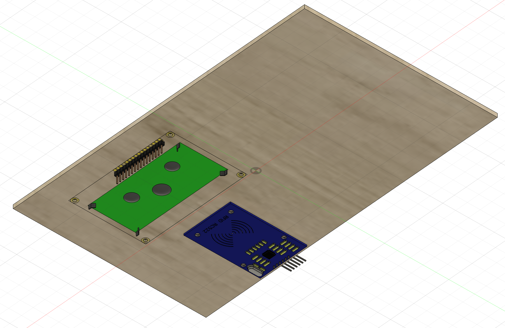
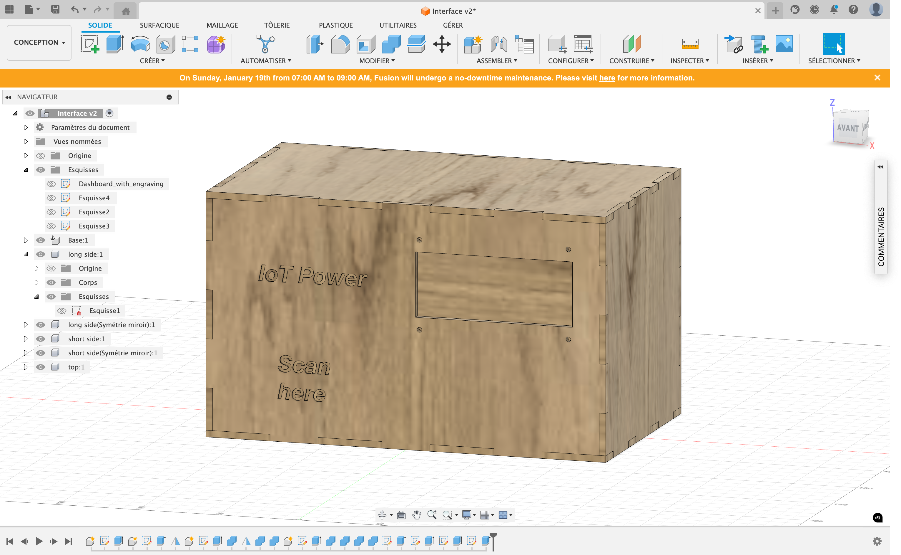
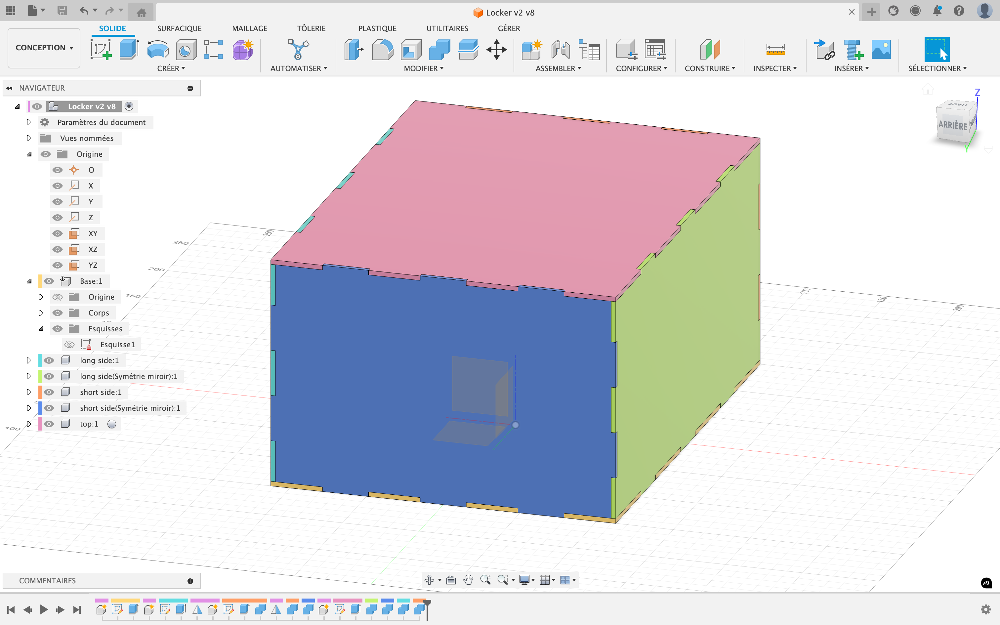
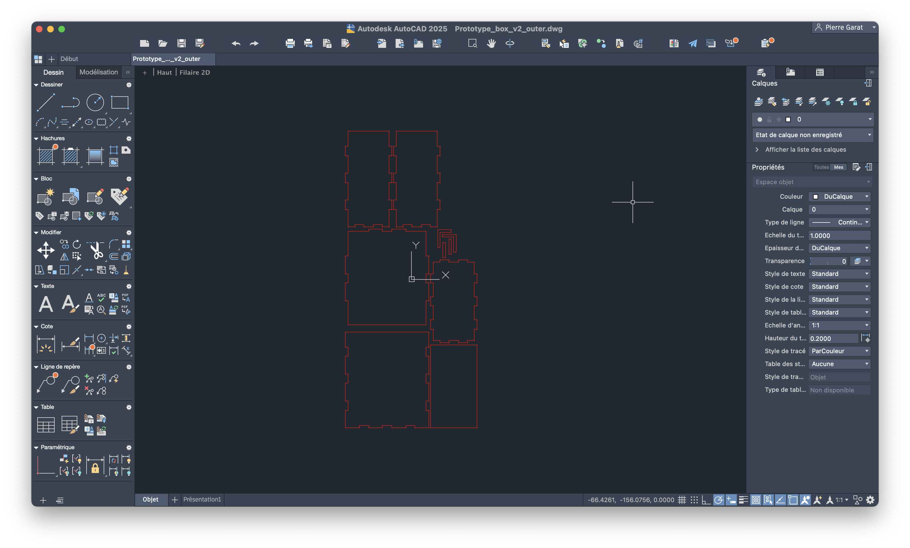

# Interaction Box Design

## The board

### Overview
This is a main board to hold essential components for the device. It is crafted to  mount a 16x4 LCD screen and an RC522 RFID scanner module. The board will be fabricated using a laser cutter and 3mm plywood.

"IoT Power" is engraved on the left side of the board and "Scan here" is engraved near the RFID scanner to indicate its purpose.

### Material specifications
- 3mm plywood  
- The board dimensions are 250mm x 150mm

### Notes
- The engraved labels will guide users to understand the functionality of each component.
- The plywood material gives an eco-friendly aesthetic, while being sturdy enough to hold the components securely.

### Files

- [Fusion 360 file](https://gitlab.fdmci.hva.nl/IoT/2024-2025-semester-1/group-project/yoogaaciinuu24/-/blob/main/design/Dashboard.f3z?ref_type=heads)
- [STL file (preview on GitLab available)](https://gitlab.fdmci.hva.nl/IoT/2024-2025-semester-1/group-project/yoogaaciinuu24/-/blob/main/design/Dashboard.stl?ref_type=heads)
- [DXF file for laser cutting](https://gitlab.fdmci.hva.nl/IoT/2024-2025-semester-1/group-project/yoogaaciinuu24/-/blob/main/design/Dashboard_with_engraving.dxf?ref_type=heads)

### Update

This board was updated and transformed into a box to hold more embedded components such as the breadboard and the microcontroller

## The locker

## Overview

The second version of the locker prototype improves upon the initial design by incorporating finger joints for increased durability and ease of assembly. This version also includes stackable features and additional support to align with the project's requirements for modularity and robustness.

---

## Key Features

- **Finger joints for durability**
   - Finger joints were designed in Fusion 360 to improve the structural integrity of the locker.
   - The joints allow precise interlocking of panels, reducing the reliance on adhesives.
   - A tutorial was followed to implement these joints effectively ([Fusion 360 Finger Joints Tutorial](https://www.youtube.com/watch?v=ZrcqauNvt0M)).

- **Two 4mm wood sheets**
   - The prototype uses 4mm-thick MDF wood sheets, chosen for their affordability and ease of laser cutting.
   - Edges are reinforced with finger joints to ensure durability under repeated stacking or handling.

- **Stackable edges**
   - The top and bottom edges of the locker were modified to include alignment guides, allowing multiple lockers to be securely stacked.
   - This feature adds modularity and flexibility for applications requiring expandable storage systems.

- **Adjustments with AutoCAD**
   - After initial design in Fusion 360, minor adjustments were made in AutoCAD adjust the dimensions.
   - The adjustments focused on tolerances to account for the laser cutter's kerf and material thickness.

---

## Manufacturing process

1. **Design**
   - Created the overall shape and added finger joints in Fusion 360.
   - Ensured all edges aligned perfectly for clean assembly.

2. **Adjustment**
   - Exported the design to AutoCAD for precise dimensional adjustments.
   - Verified tolerances for the laser cutter.

3. **Fabrication**
   - Laser-cut all panels from two 4mm MDF sheets.
   - Assembled the panels manually, interlocking the finger joints.
   - Tested stacking alignment and structural integrity.

## Files

- [Fusion 360 file](https://gitlab.fdmci.hva.nl/IoT/2024-2025-semester-1/group-project/yoogaaciinuu24/-/blob/main/design/Locker_v2.f3d?ref_type=heads)
- [STL file (preview on GitLab available)](https://gitlab.fdmci.hva.nl/IoT/2024-2025-semester-1/group-project/yoogaaciinuu24/-/blob/main/design/Locker_v2.dxf?ref_type=heads)
- [DXF file for laser cutting](https://gitlab.fdmci.hva.nl/IoT/2024-2025-semester-1/group-project/yoogaaciinuu24/-/blob/main/design/Prototype_box_v2.dxf?ref_type=heads)
- [DXF outer file for laser cutting](https://gitlab.fdmci.hva.nl/IoT/2024-2025-semester-1/group-project/yoogaaciinuu24/-/blob/main/design/Prototype_box_v2_outer.dxf?ref_type=heads)

