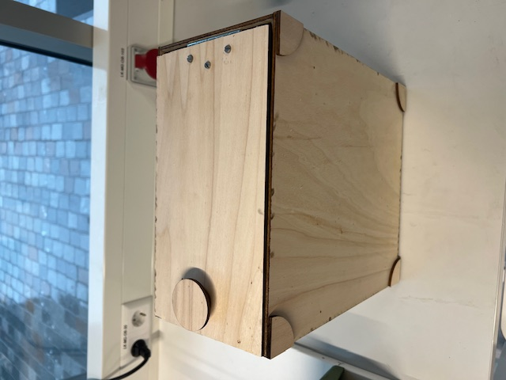

# First prototype of the locker

The first prototype was created using Fusion 360. This tool makes it possible to create 3D designs that can be used in the makers lab. By exporting the sketch made in the tool the laser cutter can be used. To explain the way of making the design I have created this documentation file. After explaining the prototype I will discuss the improvements that have to made in the second prototype. The following topics will be discussed in this file.

1. The design
2. Laser cutting
3. The materials
4. Improvements for the next prototype

## The design

As mentioned before Fusion 360 was used in the design of the first prototype. Below is an image of the design with numbers of parts that are explained below. The Fusion 360 file is also added to the project in the static/design folder named LockerDesignV1.

1. These are the wall of the locker. There are two shorter back wall and two longer side walls. The dimensions used are based on power cable dimesnions found on the internet. I found multiple dimensions so to be sure the power cable would fit I used the biggest dimensions found.

2. These are the top and bottom parts of the locker. The cicles in the corners are used to make the indentations in the plywood. After uploading the sketch to the laser cutting program I removed the part of the circle that exceeds the boundaries of the rectangle. Only the ceeling of the locker should have a indentation but I used the indentation marks of the wall to make raised cutouts to attatch to the floor of the locker. This was done by moving the new quarter circles to the side of the box and cutting these out separately.

3. These circles are used to make the doorknob of the locker. By having multiple smaller and at least one bigger circle the circles can be glued together. This makes for a cone with a bigger end. This is turn results in a doorknob.

## Laser cutting

After making the design the next step of the prototype was using the laser cutter in the Makerslab. This was done by uploading the sketch to a USB and loading it into the computers used for laser cutting. I gave the lines that should be indented a red color and the lines that should be cut a black line. By setting different laser depts in the settings of the tool used by the computer I was able to make a differentiation in cutting and engraving. I baught the thickest plywood available and set the cutting settings accordingly. By weighing the plywood down at the edges I was able to compensate a slight curve in the wood.

After using the buttons on the laser cutter I found that the design of the locker was to big for the plywood. This resulted in me having to cut the desing in half and cutting two separate pieces of plywood. This was no big issue because I could use the design tool of the computer attatched to the laser cutter to do this. After cutting two pieces of plywood I now had the plywood parts to assamble the locker. I did not have all the materials yet because I needed bolts, nuts and a doorhinge. I taught that I could get these parts from the Makerslab but only the correct bolts were present. This resulted in me having to go to Praxis to get the right parts. The walls, ceeling and floor were glued together and the bolts were screwed into the wood using a screwdriver. By gluing the circels together I created the doorknob. I also glued the raised corners to the floor of the locker this was the last part to add.

After all these steps the locker was assembled. The images below shows the locker after it was finished.

### Locker top view

### Locker top view with open door

### Locker bottom view

## The materials
There are multiple materials used for the locker. The most important part is the plywood used. we asked the Makerslab for the strongest wood they had and they advised me to use MDF wood. This plywood is still not very strong or thick but if we want to use stronger wood we have to decide on using wood baught from a hardware store.

As mentioned before the makerslab only had bolts that could be used in assembling the locker. The Makerslab had nuts but not the correct size for the hinge we were using. The hinge itself had to be baught from Praxis because the Makerslab nad no hinges available. 

The hinge baught was a 70x70mm doorhinge of the brand I-Fix. The nuts used have a size called M4 and are described as zeskantmour gegalviniseerd. The producer of the nuts is called Maxeda DIY. The bolts used for the locker were available in the makerslab and were the smallets bolts available. These were the only bolts to fit the holes in the doorhinges.

## Improvements for the next prototype
After building the prototype we found that the wood used in the desing was not very sturdy. The wood used should be altered becasue the locker is not very strong and the walls can be broken easily. To get better wood for the next prototype we need to go to a hardware store and buy stronger wood. The desing also does not offer an easy was to attatch the sides of the locker together. The sides have to be glued and only the glue is holding the locker together. This could become a problem when multiple lockers are stacked on top of eachother. By using a interlocking desing called a finger desing the walls fit together better and the locker should be stronger. This idea came from the drawer test that was printed to test the settings and desings made for laser cutting.

The indents of the locker are not very deep because the plywood used is very thin. This results in the locker possibly not fitting on top of eachother very good. By using thicker wood the indentations made can be made deeper and the lockers should not be movable by pusing or pulling an individual locker.
