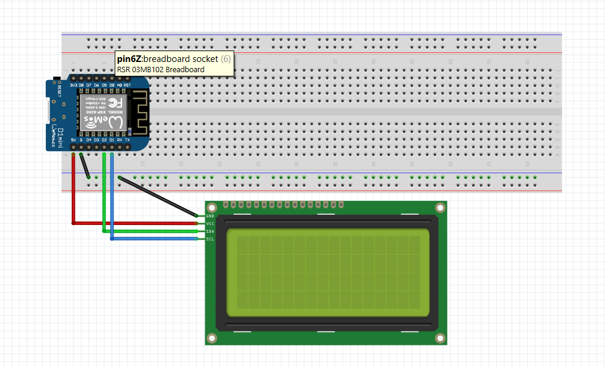

# LCD
This is the documentation for the LCD screen on this page you can find a Fritzing diaram showing the wiring of the LCD screen to the Wemos D1 Mini. The page also has an explaination of the LCD code that makes the LCD scroll text in an idle state and makes the LCD show a unlocked message after a card is scanned.

## Wiring diagram


## Code explainantion
The code that was made in PlatfromIo has two main functions. The LCDScroll and printLockerLCD functions. For both functions I will explain what happens in the functions.

### LCDScroll funtion
The LCDScroll function is the idle state for the LCD. The LCD shows a scrolling text when no interaction is made with the locker. This idle state happens beause the LCDScroll function is called every loop in the main.cpp file.

In the code snippet below you can see that the LCDScroll function keeps track of an index. This is used to keep track of how far the text on the LCD screen moved to the right. When the text would isappear from the screen the location of the text will be reset.

It is important to understand that the text on the LCD is cut to move the text that is outside of the LCD to the start of the LCD. This gives an effect that looks like the text moving from left to right. By printing the altered text every loop in the main.cpp the text moves from left to right. 

```cpp
void LCDScroll(){
    // Add one to the index to move the from left to right.
    placeIndex ++;
    // If the text reaches the end on the LCD reset the text.
    if (placeIndex > lcd_Chars){
        placeIndex = 0;
    }
    // Clear the LCD to place the new scroll text.
    lcd.clear();
    lcd.setCursor(0, 1);
    // Cut of text so it will not appear on the next line.
    int devideString = lcd_Chars - placeIndex;
    String tempdisplay_text = display_text.substring(0, devideString);
    String cutOffPartText = display_text.substring(devideString);
    String combinedCutText = cutOffPartText + "   " + tempdisplay_text;
    // Print the altered display text.
    lcd.print(combinedCutText);
}
```

### printLockerLCD function
The printLockerLCD function is called when a locker will be unlocked in the main.cpp file. The main.cpp file contains a if statemant that is allowed to pass when a user scans a valid card on our card reader. After the Wemos retrieves the locker that will be unlocked from the back-end API the locker number should be displayed by the LCD. This is done in the printLockerLCD function. The function reuires the locker number that will be unlocked. This locker number is stored in the main.cpp after using the api.cpp file to retrieve the correct locker number. This number is then send to the function as a function parameter. The retrieved number is stored as a String because the number is retrieved from the Json of the back-end API. The API echos the values as Strings. Now that the locker number is known the locker number can be displayed on the LCD screen. The printLockerLCD function differentiates the locker number being found or not. This is done because the locker sentence that will be used is not valid when no locker is found. After maing a no locker found sentence possible the temp_number variable can be simply added to a string and printed on the LCD screen. After the locker number is shown the scrolling text function will resume but the placeIndex variable will be reset to make sure the scroll function starts from scratch.

```cpp
void printLockerLCD(String temp_number){
    lcd.clear();
    if (temp_number == "No locker found."){
        lcd.print("No locker found.");
    }
    else {
        lcd.print("Locker " + temp_number + " unlocked.");
    }
    placeIndex = 0;
}
```

### LCD vendor
The LCD we are using was baught on Amazon. This is a link to the LCD screen found there: [LCD Screen](https://www.amazon.nl/dp/B0DFCH9V32?ref_=pe_28126711_487767311_302_E_DDE_dt_1).

### Libraries used
To make the code that was made for the LCD work the LiquidCrystal_I2C library was used. The library was added to the platformio.ini file. To look at the library I added a link to the library found online [LiquidCrystal_I2C library](https://www.arduinolibraries.info/libraries/liquid-crystal-i2-c). The LiquidCrystal_I2C library allows for our team to use functions to control  I2C displays. When using this library we can easily display text on our LCD.
